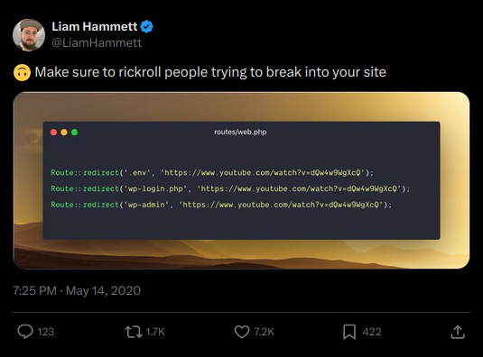

# Rickroll people trying to break into your Laravel site


[](https://packagist.org/packages/lukasmu/laravel-rickroll)
[](https://github.com/lukasmu/laravel-rickroll/actions/workflows/run-tests.yml?query=branch%3Amain++)
[](https://github.com/lukasmu/laravel-rickroll/actions/workflows/format-code.yml?query=branch%3Amain++)
[](https://coveralls.io/github/lukasmu/laravel-rickroll?branch=main)
[](https://packagist.org/packages/lukasmu/laravel-rickroll)

Sometimes you just gotta rickroll people who attempt to mess with your website.
This lightweight package adds some redirect routes to your Laravel website in order to redirect these people to Rick Astley's *Never Gonna Give You Up*.

Credit to Liam Hammett for his [tweet](https://twitter.com/LiamHammett/status/1260984553570570240/) (7k+ likes) that inspired this package!



## Installation

You can install the package via composer:

```bash
composer require lukasmu/laravel-rickroll
```

## Usage

Just install the package. 
That's it. 
By default the following paths will be redirected to *Never Gonna Give You Up*:

- .env
- .git
- wp-admin
- wp-login
- wp-login.php
- composer.lock
- yarn.lock
- package-lock.json
- xmlrpc.php
- typo3
- phpinfo.php
- .htaccess

Do you know any well-known paths that people might use to mess with your website?
Add them in the config file, and submit a pull request, thanks!

## Customization

You can publish the config file with:

```bash
php artisan vendor:publish --provider="LukasMu\Rickroll\RickrollServiceProvider" --tag="config"
```

Feel free to edit the published config file in order to customize the Rickroll behaviour.

## Changelog

Please see [CHANGELOG](CHANGELOG.md) for more information what has changed recently.

## Contributing

Contributions are **welcome** and will be fully **credited**.
Feedback is very much appreciated as well.

Please see [CONTRIBUTING](CONTRIBUTING.md) for details.

## Testing

The package includes tests which can be run by calling:

```bash
composer test
```

## Security

If you discover any security related issues, please email [hello@lukasmu.com](hello@lukasmu.com) instead of using the issue tracker.

## Credits

- [Lukas Müller](https://github.com/lukasmu)
- [All Contributors](../../contributors)

This package has been derived from [Felix Dorn's](https://github.com/felixdorn/laravel-rickroll) and [Mitchell Johnson's](https://github.com/mitchazj/laravel-rickroll) packages but has been greatly simplified and properly versioned.

## License

The MIT License (MIT).
Please see [LICENSE](LICENSE.md) for more information.
